<!-- title: SoundVault -->
<!-- PROJECT LOGO -->
<br />
<div align="center">
  <a href="[csc13002-sound-vault.vercel.app](csc13002-sound-vault.vercel.app)">
    
  </a>
  <h1 align="center">SoundVault</h1>
  <p align="center">
    Decentralized application for digital music copyright
    <br />
    <a href="[csc13002-sound-vault.vercel.app](csc13002-sound-vault.vercel.app)">Live!</a>
  </p>
</div>

# Description
SoundVault is a decentralized application to support artists in music copyright management with the following highlighted features:

* **Song management:** get music copyright, view copyright, change thumbnail/cover, upload song
* **Playlist management:** change thumbnail/cover, add to/remove from playlist
* **Song explorer**
* **Song ranking chart**
* **Social features:** following, avatar/cover customization, recently played songs, liked playlist, notification, etc
* **Wallet (donate/withdraw/deposit):** supports for most banking account in Viet Nam to donate for favourite song
* **Share song profit equally by smart contract:** song profit is shared equally to song author and collaborators
* **Administrator view:** the application also offers administrator platform to control the quality of songs, resolve user problems and support them on song verification

SoundVault not only emphasizes core functionalities but also prioritizes UI/UX to ensure users can interact easily and benefit from high-quality reliability.

# Screenshots
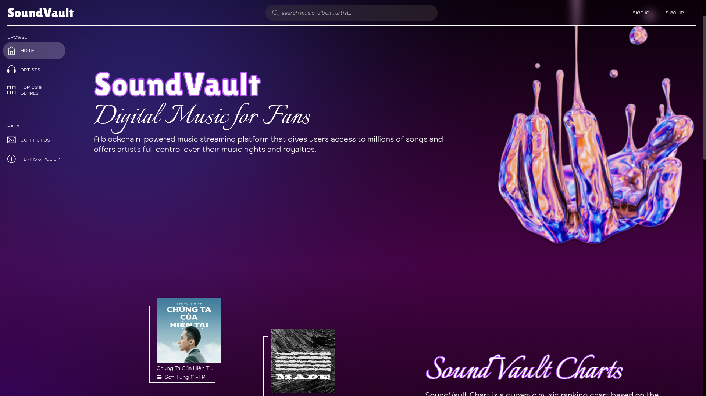
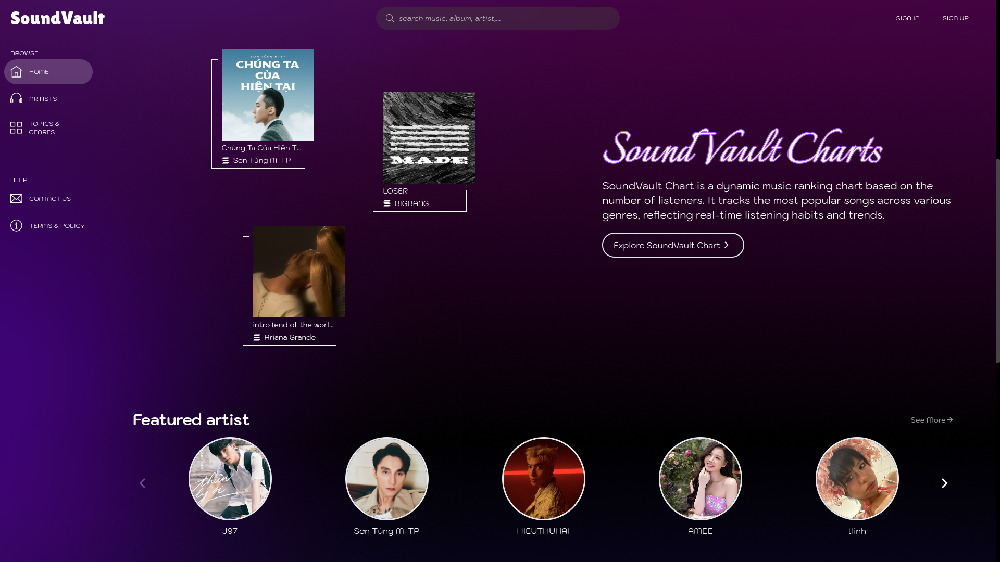
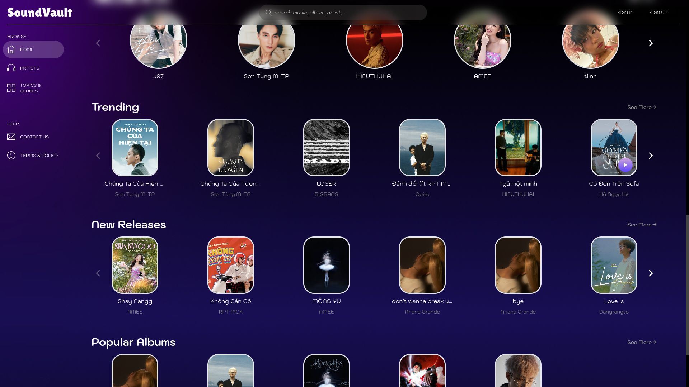
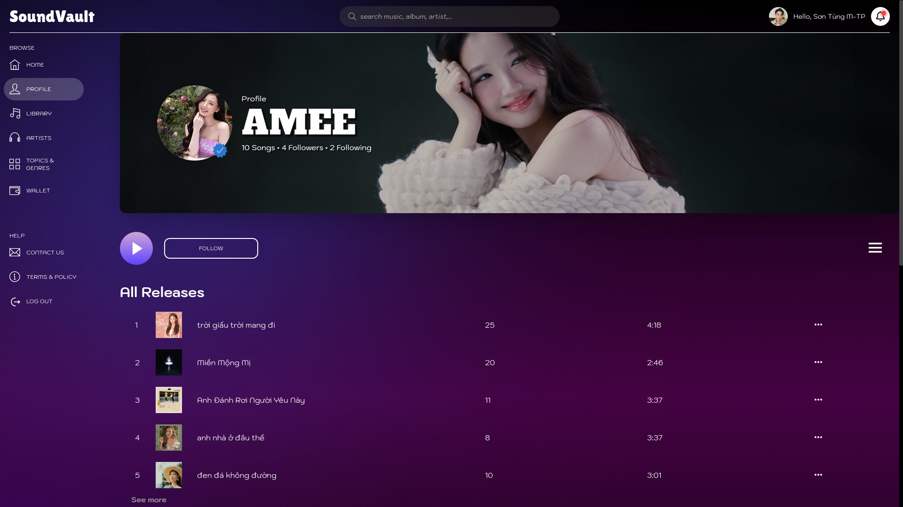
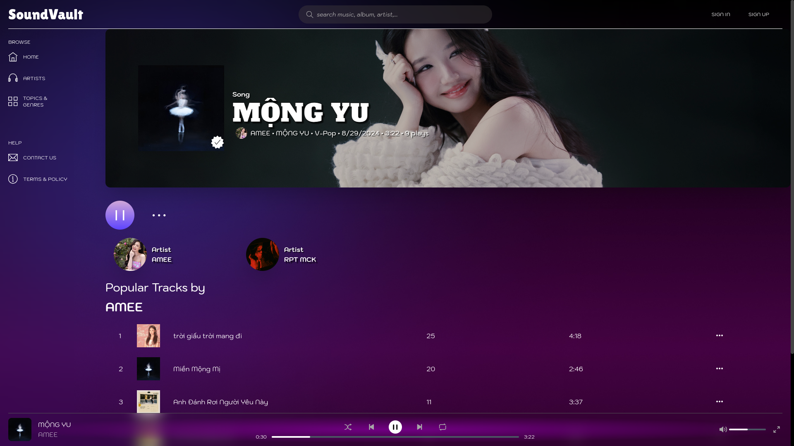

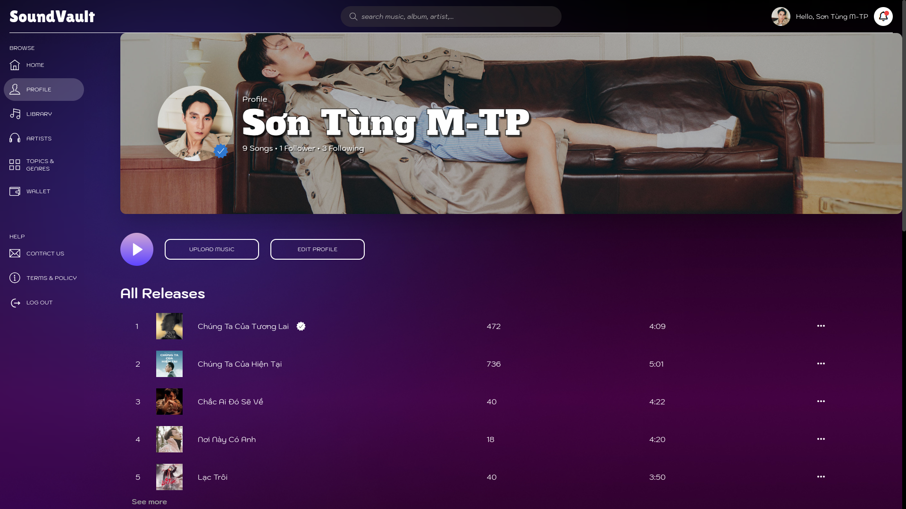
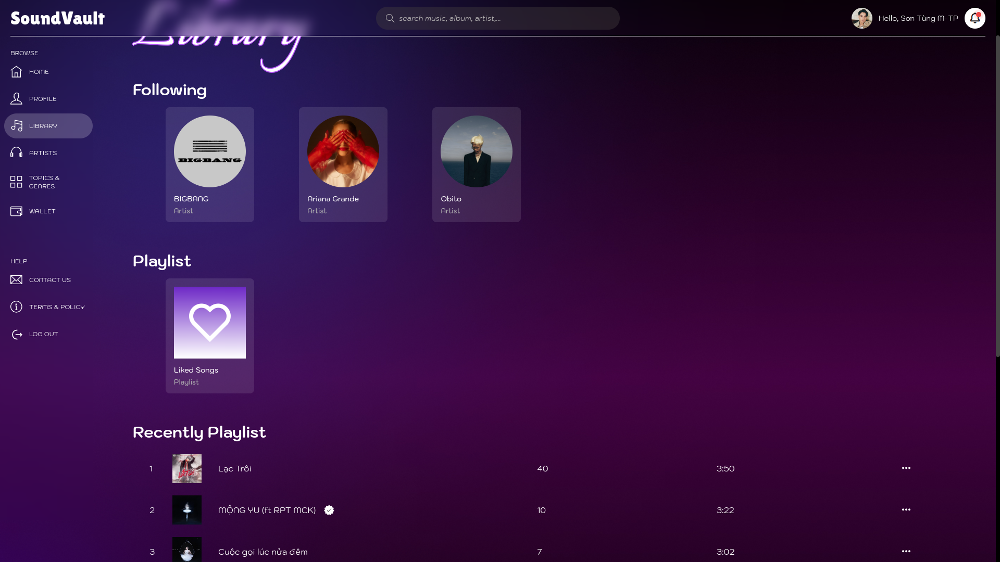
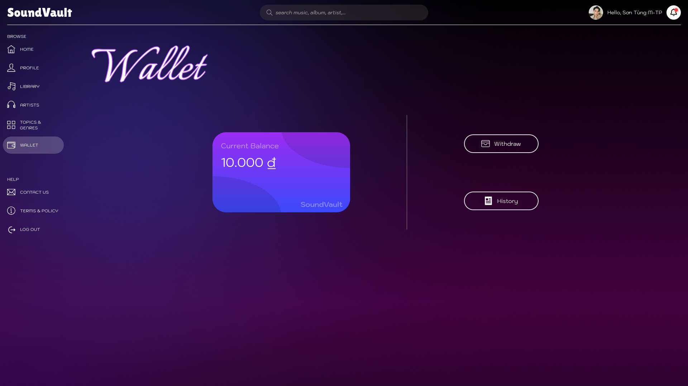
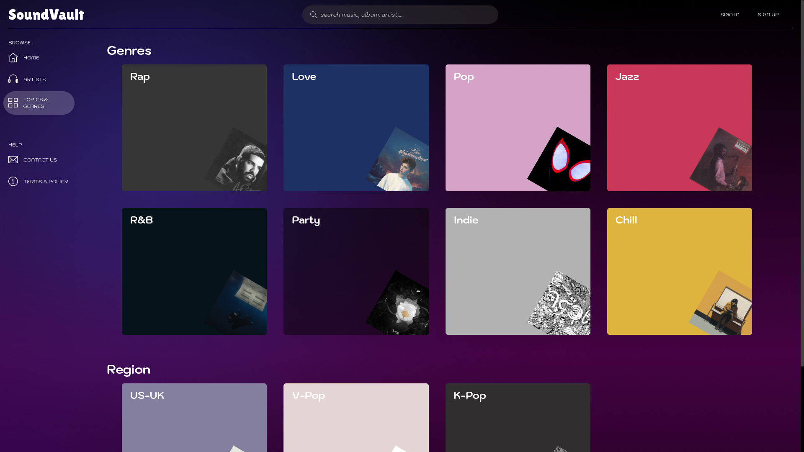
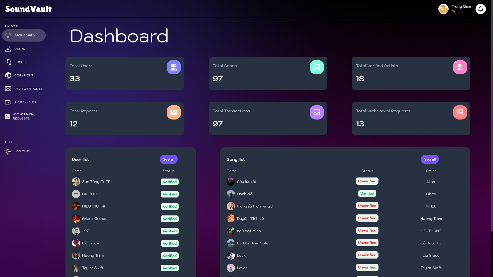
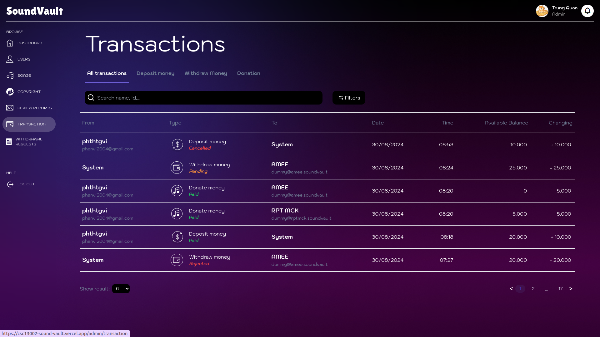

# Tech stack
## Frontend 
![ReactJS][React]

## Backend 
![Express.js][Express.js]
![MongoDB][MongoDB] ![Mongoose][Mongoose]
![Cloudinary][Cloudinary]
![Ethers.js][Ethers.js]

## Blockchain
![Hardhat][Hardhat]

## Deployment
![Render][Render]
![Vercel][Vercel]

# Building
1. Install [Node.js](https://nodejs.org/en/)
2. Clone the repository
```sh
git clone https://github.com/ntkwan/csc13002-sound-vault.git
```
3. Run `npm install` to install all dependencies (do it individually with `backend`, `frontend` and `root` directory).


# Usage
Run in the `root` directory to concurrently start the server and client.
```sh
npm run start
```
**Note:** Deposit feature requires Viet Nam bank account ID and actually working in production environment. 

# Client
```
.
├── dist
|-- src
|   |-- components, features, hooks, pages, etc
|   |-- routes
|   |-- services
```

- **dist**: Automatically build with Vite and to be deployed
- **src**: The folder that contains the source code
- **src/components, features, hooks, pages**: The folder that contains the controllers which handle the requests
- **src/routes**: The folder that contains the routes which define the endpoints
- **src/services**: The folder that contains the services which handle the business logic

# Server
```
.
|-- src
|   |-- config
|   |-- controllers
|   |-- middleware
|   |-- models
|   |-- routes
|   |-- utils
|   server.js
```

- **src**: The folder that contains the source code
- **src/config**: Database and cloud storage (Cloudinary) configuration
- **src/routes**: The folder that contains the routes which define APIs interface
- **src/controllers**: The folder that contains the services which handle the business logic
- **src/models**: The folder that contains such schemas: accounts, songs, playlists, etc
- **src/utils**: The folder that contains such functions to define axios request to setup payment protocol (PayOS)
- **src/middleware**: The folder that contains middlewares to manage authorization and middle-logic implementation (payment validation, file filter, etc)


<!-- MARKDOWN LINKS & IMAGES -->
[React]: https://img.shields.io/badge/react-61DAFB?style=for-the-badge&logo=react&logoColor=black
[Express.js]: https://img.shields.io/badge/express-%23000000?style=for-the-badge&logo=express&logoColor=white
[MongoDB]: https://img.shields.io/badge/mongodb-%2347A248?style=for-the-badge&logo=mongodb&logoColor=white
[Mongoose]: https://img.shields.io/badge/mongoose-%23880000?style=for-the-badge&logo=mongoose&logoColor=white
[Ethers.js]: https://img.shields.io/badge/ethers-%232535A0?style=for-the-badge&logo=ethers&logoColor=white
[Cloudinary]: https://img.shields.io/badge/cloudinary-%233448C5?style=for-the-badge&logo=cloudinary&logoColor=white
[Render]: https://img.shields.io/badge/Render-%23000000?style=for-the-badge&logo=render&logoColor=white
[Vercel]:https://img.shields.io/badge/vercel-%23000000?style=for-the-badge&logo=vercel&logoColor=white
[Hardhat]: https://img.shields.io/badge/hardhat-FFCC2F?style=for-the-badge&logo=hardhat&logoColor=black


